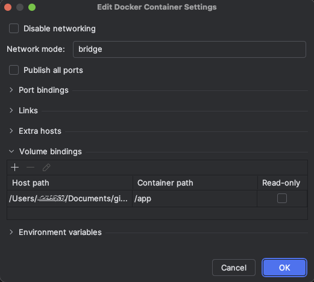

# Set up PHPStorm for PHP CodeSniffer

This guide will help you set up PHPStorm to use PHP CodeSniffer. You will be
able to see code highlighting and use auto-fixing in your IDE.

How long will it take: 15 minutes

## Pre-requisites
- Completed guide: [PHP-Interpreter](../phpInterpreter/PhpInterpreter.md)
- A local composer project, fully installed

## Steps

1) Open the PHPStorm IDE and load up the project you want to work on.
2) Open the settings dialog by pressing `Ctrl + Alt + S`(Windows + Linux)
   `CMD + ,` (macOS).
3) Navigate to "PHP" -> "Quality Tools" -> "PHP CodeSniffer" and open the
   Configuration by clicking on the "..." button.
   
4) If your [PHP interpreter](#Set-up-the-PHP-interpreter) we just set up in the
   last step is not automatically added to the list click on the "+" button to
   add it now.
5) Fill the Dialog as follows
    * `PHP_CodeSniffer path` must be `/coding-standard/vendor/bin/phpcs`
    * `Path to phpcbf` must be `/coding-standard/vendor/bin/phpcbf`

   
6) Click on the Folder Icon in `Docker container` and change the Volume bindings
   as follows. The only entry allowed here is Hostpath = absolute Path to your
   project ->  Container path = /app

   
7) Return to "PHP" -> "Quality Tools" -> "PHP_CodeSniffer".
8) Choose your newly added configuration and Switch it on.
9) Now we have to do something wierd. Close the settings dialog. Navigate to a
   PHP file and do any change. Any change will do. Just add a space.
10) Return to the settings dialog by pressing `Ctrl + Alt + S`(Windows + Linux)
    `CMD + ,` (macOS).
11) Navigate to "PHP" -> "Quality Tools" -> "PHP CodeSniffer" and
    choose `ZooRoyal` as Coding standard.
12) Close dialog. You are done.
