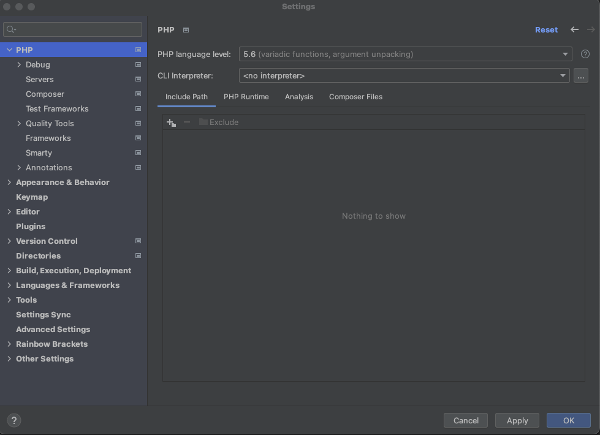
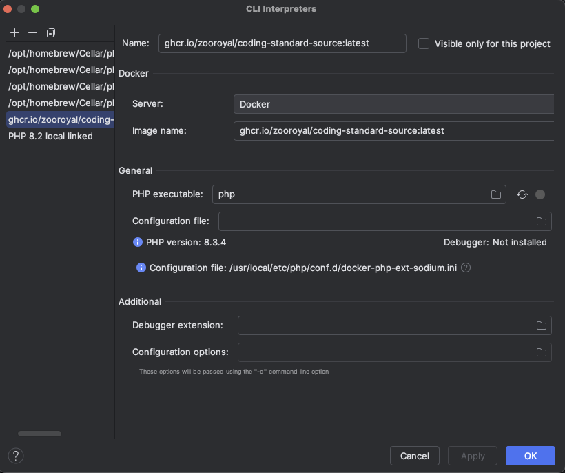

# Set up the PHP interpreter

## Docker

This guide will show you how to install the PHP-Interpreter you need to execute
the coding-standard application.

How long will it take: 5 minutes

Pre-requisites:
- Running Docker service on your local machine

## Steps

1) Open the PHPStorm IDE and load up the project you want to work on.
2) Open the settings dialog by pressing `Ctrl + Alt + S`(Windows + Linux)
   `CMD + ,` (macOS).
3) Remember what interpreter you are using right now
4) Navigate to "PHP" and open the interpreter settings by clicking on the
   "..." button next to the interpreter dropdown.
   
5) Click on the "+" button to add a new interpreter.
   Choose `From Docker`. In the following dialog choose `Docker` and use the image
   `ghcr.io/zooroyal/coding-standard-source:latest`. Check that all settings are
   equal to the image linked below.
   
6) Make sure you don't forget to tick `Visible for all projects`.
7) Close this dialog.
8) Do not choose this interpreter as default CLI Interpreter. Use what you saw in step 2).

