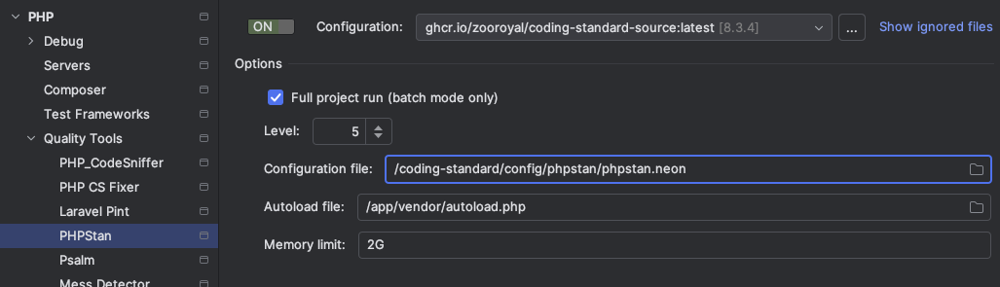
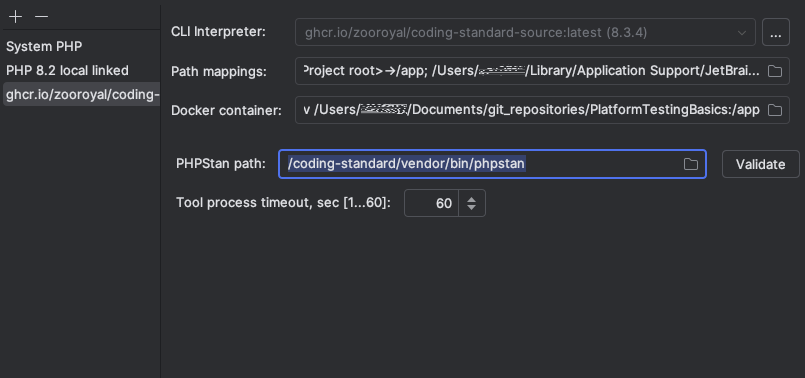
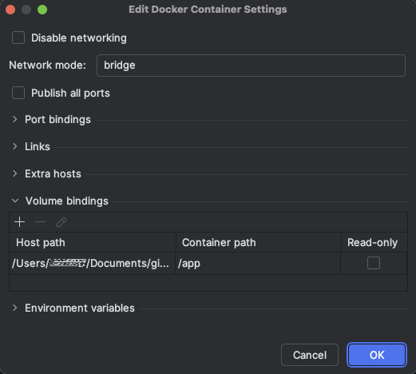

# Set up PHPStorm for PHPStan

This guide will help you set up PHPStorm to use PHPStan. You will be
able to see code highlighting and use auto-fixing in your IDE.

How long will it take: 15 minutes

## Pre-requisites
- Completed guide: [PHP-Interpreter-Guide](../phpInterpreter/PhpInterpreter.md)
- A local composer project, fully installed

## Steps

1) Open the PHPStorm IDE and load up the project you want to work on.
2) Open the settings dialog by pressing `Ctrl + Alt + S`(Windows + Linux)
   `CMD + ,` (macOS).
3) Navigate to "PHP" -> "Quality Tools" -> "PHPStan" and open the
   Configuration by clicking on the "..." button.
   
4) If your [PHP interpreter](#Set-up-the-PHP-interpreter) we set up in [PHP-Interpreter-Guide](../phpInterpreter/PhpInterpreter.md)
   is not automatically added to the list click on the "+" button to add it
   now.
5) Fill the Dialog as follows
    * `PHPStan path` must be `/coding-standard/vendor/bin/phpstan`

   
6) Click on the Folder Icon in `Docker container` and change the Volume bindings
   as follows. The only entry allowed here is Hostpath = absolute Path to your
   project ->  Container path = /app

   
7) Return to "PHP" -> "Quality Tools" -> "PHPStan".
8) Choose your newly added configuration and Switch it on.
9) Now we have to set the options. Please make very sure that you don't miss anything.
   * Check Full project run
   * Set `Level` to `5`
   * Set `Configuration file` to `/coding-standard/config/phpstan/phpstan.neon`
   * Set `Autoload file` to `/app/vendor/autoload.php`

   
10) Close dialog. You are done.
